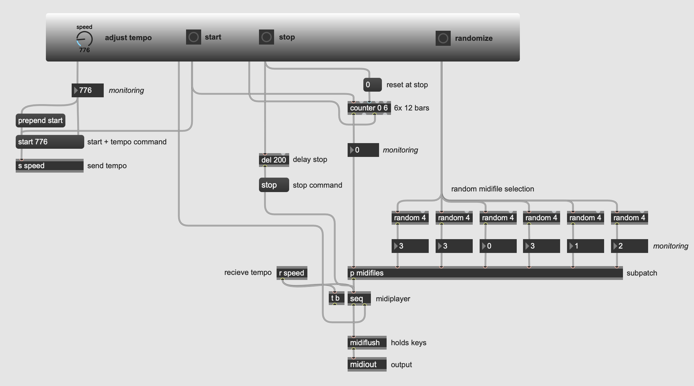

# Aleatoric randomness blues
This patch harnesses aleatoric randomness to craft diverse blues compositions. It features six loops, each capable of transitioning between four different 12-bar blues sequences (MIDI files). Through the 'randomize' button, users can generate new compositions. Additionally, they have the flexibility to adjust the tempo to their preference, further enhancing the creative possibilities offered by the patch. [See a demonstration of the patch in use here.](https://www.thomaseg.dk/)

## Patch interface

